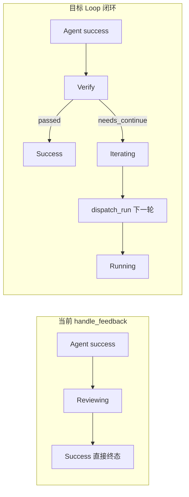
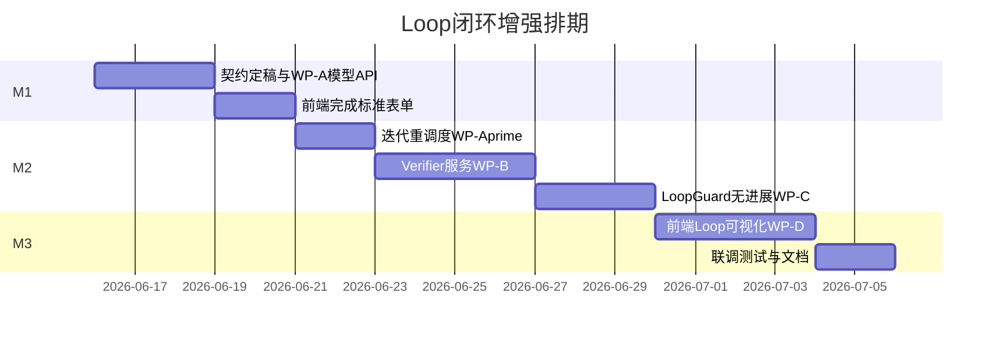

# Task Platform Loop 闭环 — 迭代计划评估与优化方案

## 一、对《下一步迭代计划.md》的评估

### 1.1 总体判断：方向正确，可直接作为实施主线

文档与 [关于loop.md](docs/关于loop.md)、[产品PRD.md](docs/产品PRD.md) 高度一致，核心判断准确：

> 当前矛盾不是「能不能跑」，而是 **Goal 不可验证、缺少 Verifier、Loop 治理不可观测**。

四工作包顺序（A 模型 → B 验证 → C 收敛 → D 可视化）合理，范围控制得当（暂不引入 LLM Verifier、多租户等），M1/M2/M3 排期（约 11–17 天）与工作量基本匹配。

### 1.2 文档优点

| 维度 | 评价 |
|------|------|
| 问题定义 | 精准对应 PRD 3.2「循环兜底控制」与 Loop 设计 4.1–4.3 |
| 优先级 | 正确拒绝「先堆 Agent 类型 / 企业能力」 |
| 验收标准 | 每条工作包有可测 DoD |
| 风险意识 | 对状态机回归、规则过重、误判无进展有预案 |

### 1.3 需补充的关键遗漏（对照代码库）

原文档未显式覆盖以下 **已实现骨架但未闭环** 的部分：



**差距清单：**

| 计划项 | 文档状态 | 代码现状 | 差距 |
|--------|----------|----------|------|
| WP-A `success_criteria` | 必做 | [entities.py](apps/api/app/models/entities.py) 仅 `objective` | 字段、迁移、API、前端均未实现 |
| WP-B 规则 Verifier | 必做 | [task_service.py L221-223](apps/api/app/services/task_service.py) success 直转 SUCCESS | 无 VerifierService，无验证记录 |
| WP-C `no_progress_threshold` | 必做 | [dto.py](apps/api/app/schemas/dto.py) + [tasks/page.tsx](apps/web/src/app/tasks/page.tsx) 已有字段 | **[loop_guard.py](apps/api/app/services/loop_guard.py) 未实现检测逻辑** |
| WP-C 进展快照 | 必做 | 无 | 无 ProgressSnapshot 存储 |
| **迭代重调度** | 未提及 | 状态机有 `Iterating`，但 `handle_feedback` 从不进入该状态 | **Loop 实际无法多轮执行** |
| WP-D 迭代可视化 | 必做 | 仅有扁平日志 [tasks/page.tsx L484-488](apps/web/src/app/tasks/page.tsx) | 无验证结果、终止原因、轮次时间线 |
| 测试 | 提及 | 仅 [test_state_machine.py](apps/api/tests/test_state_machine.py) 静态转移 | 无 feedback/verifier/loop 集成测试 |

**结论：** 原文档战略层完整，但需在 **M2 前增加「迭代重调度接线」** 作为 B/C 的前置子任务；M1 需 **提前锁定 JSON 契约**，避免前后端与 Verifier 规则不一致。

---

## 二、优化后的实施计划

### 阶段 0：契约定稿（M1 第 1 天，与 WP-A 并行）

在写迁移前冻结以下结构（写入 [关于loop.md](docs/关于loop.md) 或独立 `docs/loop-contracts.md`）：

**Task 新增字段（JSONB）：**

```json
{
  "success_criteria": {
    "rules": [
      { "type": "field_equals", "path": "tests_passed", "value": true },
      { "type": "field_exists", "path": "report_url" }
    ],
    "match": "all"
  },
  "failure_criteria": { "rules": [], "match": "any" },
  "verification_mode": "rule_based"
}
```

**Verifier 输出枚举：** `passed | failed | needs_continue`

**第一版规则类型（4–5 种即可）：** `field_exists`、`field_equals`、`field_not_exists`、`status_in`

**兼容策略：** 三字段均为空/null 时，Verifier 退化为「Agent success → passed」（保持现有行为，零回归）。

---

### WP-A：任务目标模型增强（M1，3–5 天）

**后端改动：**

- [entities.py](apps/api/app/models/entities.py)：`Task` 增加 `success_criteria`、`failure_criteria`（JSONB，默认 `{}`）、`verification_mode`（String，默认 `rule_based`）
- 新增 Alembic 迁移 `002_add_goal_criteria.py`
- [dto.py](apps/api/app/schemas/dto.py)：`TaskCreate` / `TaskUpdate` / `TaskResponse` 扩展；新增 `SuccessCriteria` Pydantic 模型做基础校验
- [task_service.py](apps/api/app/services/task_service.py)：`create_task` / `update_task` 读写新字段
- [routers/tasks.py](apps/api/app/routers/tasks.py)：确保响应包含新字段

**前端改动：**

- [apps/web/src/lib/api.ts](apps/web/src/lib/api.ts)：类型与 payload 扩展
- [apps/web/src/app/tasks/page.tsx](apps/web/src/app/tasks/page.tsx)：
  - 创建表单增加「完成标准」区块（第一版可用 JSON 文本域 + 简单规则构建器二选一，建议 **JSON 文本域 + 示例模板** 以控 scope）
  - 任务列表/详情展示 `success_criteria` 摘要

**验收：** API 创建含 criteria 的任务；旧任务 CRUD/执行无报错；前端可填可展示。

---

### WP-A'：迭代重调度接线（M2 开头，1–2 天，B/C 前置）

**改造 [task_service.py handle_feedback](apps/api/app/services/task_service.py)：**

当前逻辑（需替换）：

```221:223:apps/api/app/services/task_service.py
        if status == "success":
            await self.sm.transition(run, TaskStatus.REVIEWING.value, actor=actor, detail="Feedback received")
            await self.sm.transition(run, TaskStatus.SUCCESS.value, actor=actor, detail="Task completed")
```

目标流程：

```text
success → Reviewing → Verifier.verify()
  → passed → Success
  → needs_continue → Iterating → Celery dispatch_run.delay(run_id)
  → failed → Failed / 告警
```

- `requires_action` 同样可走 `needs_continue` 路径（Agent 显式请求继续）
- 重调度前调用 `loop_guard.enforce_or_fail`（含后续 no_progress 检测）
- 工作流场景：仅 Verifier `passed` 后调用 `_advance_workflow`

**验收：** agent-simulator 配置 `requires_action` 或 Verifier `needs_continue` 时，同一 `TaskRun` 的 `iteration_count` 递增且产生多条 `Feedback`。

---

### WP-B：规则型 Verifier（M2，3–4 天）

**新增文件：**

- `apps/api/app/services/verifier.py` — `VerifierService.verify(task, feedback, run) -> VerificationResult`
- `apps/api/app/models/entities.py` — 新增 `VerificationResult` 表（`run_id`, `iteration`, `verdict`, `reason`, `signals`, `verified_by`, `created_at`）

**接入点：**

- `handle_feedback` 在 `Reviewing` 阶段调用 Verifier，写审计 `VERIFY_RESULT`
- 无 criteria 时短路为 `passed`（兼容旧任务）

**测试（新增 `test_verifier.py`）：**

- 全规则通过 → `passed`
- 缺字段 → `needs_continue` 或 `failed`（按 criteria 配置）
- 空 criteria + Agent success → `passed`（回归）

---

### WP-C：LoopGuard 无进展检测（M2 后半，2–3 天）

**扩展 [loop_guard.py](apps/api/app/services/loop_guard.py)：**

- 实现 `check_no_progress(run, loop_config, latest_feedbacks)`：
  - 读取 `loop_config.no_progress_threshold`（前端已可配置，后端需真正使用）
  - 比较最近 N 轮 `result_payload` 的 JSON 序列化是否相同（第一版足够）
  - 可选：比较 `context` 中写入的 `progress_hash`
- 在 `dispatch_run` 前或 Verifier `needs_continue` 分支调用
- 触发时：写审计 `NO_PROGRESS_TERMINATED`、告警 `NoProgressDetected`、`error_message` 含原因、转 `Failed` 或 `Terminated`

**进展快照（轻量方案）：**

- 每轮 feedback 处理后，向 `TaskRun.context.progress_snapshots` append `{iteration, payload_hash, ts}`，避免额外迁移

**验收：** 配置 threshold=2，simulator 返回相同 payload 连续 2 轮 → 自动终止 + 告警。

---

### WP-D：前端 Loop 可视化（M3，3–5 天）

**API 扩展：**

- `GET /v1/runs/{run_id}/timeline` — 聚合 Feedback + VerificationResult + STATE_TRANSITION 审计，按 iteration 分组
- 或在现有 [get_run_logs](apps/api/app/services/task_service.py) 基础上增加结构化字段，前端自行分组

**前端：**

- 将任务页「日志」升级为 **Run 详情面板**（可内嵌于 [tasks/page.tsx](apps/web/src/app/tasks/page.tsx) 或拆 `runs/[id]` 路由）：
  - 目标 + 完成标准
  - 轮次进度条（`iteration_count / max_iterations`）
  - 每轮：Agent 状态、验证 verdict、reason
  - 终止原因 Banner（区分 Agent success vs 平台判定完成 vs 无进展终止）
  - 事件时间线（复用 audit 数据）

**验收：** 用户可区分「Agent 报 success」与「平台验证 passed」；可见无进展终止原因。

---

### 测试与验证基建（贯穿 M2–M3）

| 场景 | 手段 |
|------|------|
| 验证通过 | pytest + mock feedback |
| 继续迭代 | agent-simulator `requires_action` + 自定义 `result_payload` |
| 无进展终止 | simulator 固定 payload 脚本模式 |
| 旧任务兼容 | 无 criteria 任务 E2E |
| 全链路 | 扩展 [scripts/verify.sh](scripts/verify.sh) 增加 criteria + 多轮 case |

**建议：** 为 agent-simulator 增加 env `SIMULATOR_FIXED_PAYLOAD` / `SIMULATOR_FORCE_STATUS`，便于 deterministic 联调。

---

## 三、优化后排期



| 里程碑 | 周期 | 交付物 |
|--------|------|--------|
| **M1** | 3–5 天 | 模型迁移、API、前端 criteria 表单、契约文档 |
| **M2** | 5–7 天 | 迭代重调度 + Verifier + no_progress + 审计告警 + 单元/集成测试 |
| **M3** | 3–5 天 | Run 迭代视图、终止原因、verify.sh 扩展、文档同步 |

---

## 四、风险补充与对策

| 风险 | 原方案 | 补充对策 |
|------|--------|----------|
| 状态机回归 | 先测后改 | M2 第一天写 `test_handle_feedback_flow.py` 覆盖现有 success/failed 路径作为 baseline |
| criteria 设计过重 | 第一版 JSON | M1 冻结 4 种 rule type，禁止 DSL |
| 无进展误判 | 可配置可关闭 | `no_progress_threshold=null` 时跳过；默认 null 保持现有行为 |
| 前后端不一致 | 字段对齐 | M1 第一天输出 OpenAPI 片段 + 共享 TypeScript 类型 |
| Verifier 与工作流冲突 | 未提及 | 工作流节点任务仅在 Verifier `passed` 后 `_advance_workflow` |

---

## 五、本轮完成定义（在原 DoD 基础上细化）

1. 用户可创建带 `success_criteria` 的任务（API + 前端）
2. Agent success 经 Verifier 裁决，**不再直接 Success**
3. `needs_continue` 触发同一 Run 的下一轮 dispatch（`iteration_count` 递增）
4. `no_progress_threshold` 后端生效，连续相同 payload 可终止并告警
5. Run 详情可展示轮次、验证结果、终止原因
6. ≥6 个 pytest case + verify.sh 多轮场景通过
7. [关于loop.md](docs/关于loop.md) 补充契约与状态流图

---

## 六、本轮之后的下一阶段（保持原文档展望）

本轮 DoD 全部满足后，再按优先级进入：

1. 独立 LLM Verifier Agent（与执行 Agent 分离）
2. 工作流级人工审批节点
3. Skill / Playbook 资产化
4. 成本预算与 `budget_limit` 真正 enforcement（字段已预留）
5. 长期记忆抽象

**原则不变：** 先跑稳闭环，再扩展复杂度。
